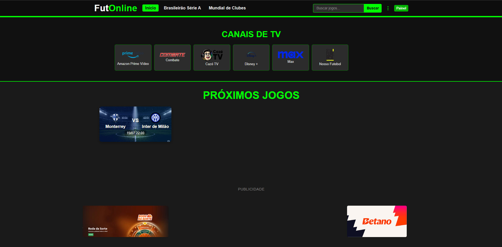
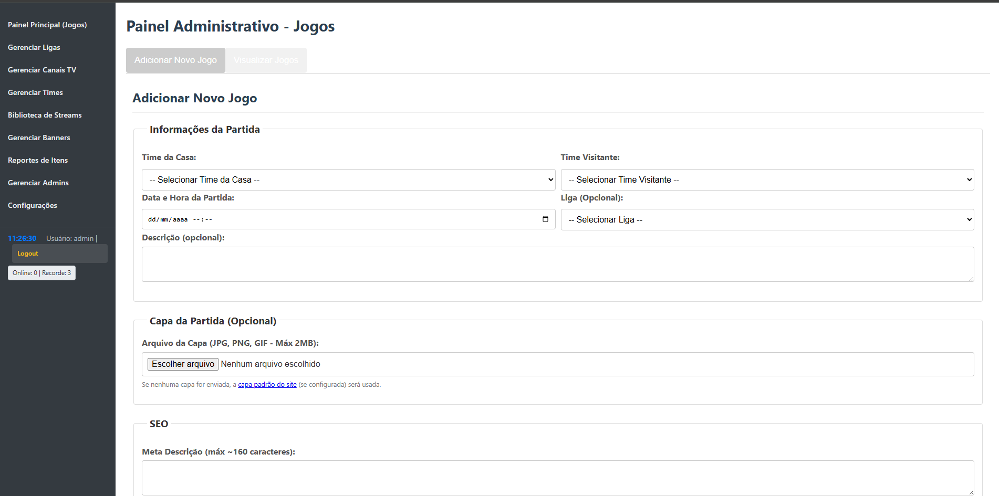

# FutOnline ⚽

Sistema web completo para gerenciamento e exibição de jogos de futebol ao vivo, canais de TV, banners publicitários, ligas, times e administração de conteúdo. Interface moderna e responsiva com painel administrativo robusto.

---

## 💖 Apoie o Projeto

Se este projeto te ajudou ou você quer contribuir para o desenvolvimento:

- **Chave Pix aleatória:**
  `a04ea8a0-d2d1-4966-9c3d-b04d62e43536`
- **QR Code para doação:**

  

---

> **Suporte profissional:**
> Precisa de ajuda, customização ou integração? Ofereço suporte pago para instalação, configuração, personalização e dúvidas técnicas.
>
> Entre em contato pelo Discord: **xpgamefps** ou acesse [https://discord.gg/nX7rnB7](https://discord.gg/nX7rnB7)

---

## 📱 Demonstração


*Página inicial com listagem de jogos*


*Painel administrativo completo*

---

## 🚀 Funcionalidades Completas

### 🌐 **Área Pública (Frontend)**

#### **Página Inicial**
- ✅ Exibição de jogos ao vivo, próximos e passados
- ✅ Filtro por ligas específicas
- ✅ Cards de jogos com cores dos times
- ✅ Banners publicitários rotativos
- ✅ Canais de TV em destaque
- ✅ Design responsivo e moderno

#### **Página de Jogo**
- ✅ Detalhes completos do jogo
- ✅ Player de transmissão incorporado
- ✅ Múltiplas opções de streams
- ✅ Informações dos times (logos, cores)
- ✅ Data, horário e liga
- ✅ Descrição detalhada
- ✅ SEO otimizado
- ✅ Banners laterais no player

#### **Sistema de Busca**
- ✅ Busca por nome do jogo
- ✅ Filtro por liga
- ✅ Resultados em tempo real
- ✅ Cards com informações dos times

#### **Player de Canal**
- ✅ Transmissão de canais de TV
- ✅ Interface limpa e moderna
- ✅ Banners publicitários integrados

#### **Sistema de Relatórios**
- ✅ Usuários podem reportar problemas
- ✅ Categorização de problemas
- ✅ Feedback visual ao usuário

### 🔧 **Painel Administrativo (Backend)**

#### **Gerenciamento de Administradores**
- ✅ Criação de novos administradores
- ✅ Edição de perfis existentes
- ✅ Sistema de permissões (superadmin)
- ✅ Remoção segura de administradores
- ✅ Hash seguro de senhas

#### **Gerenciamento de Banners**
- ✅ Upload de imagens para banners
- ✅ Banners de código HTML/JS
- ✅ Ativação/desativação por banner
- ✅ Posicionamento estratégico
- ✅ Preview em tempo real
- ✅ Remoção de banners

#### **Gerenciamento de Canais de TV**
- ✅ Cadastro de canais
- ✅ Upload de logos personalizados
- ✅ URLs de transmissão
- ✅ Ordenação customizada
- ✅ Edição e remoção

#### **Gerenciamento de Ligas**
- ✅ Criação de ligas/campeonatos
- ✅ Upload de logos das ligas
- ✅ Edição de informações
- ✅ Remoção segura
- ✅ Vinculação com jogos

#### **Gerenciamento de Times**
- ✅ Cadastro completo de times
- ✅ Upload de logos/escudos
- ✅ Cores primárias personalizadas
- ✅ Edição de informações
- ✅ Remoção com verificação

#### **Gerenciamento de Jogos**
- ✅ Criação de jogos completos
- ✅ Upload de capas personalizadas
- ✅ Vinculação com times e ligas
- ✅ Data e horário configuráveis
- ✅ Descrições detalhadas
- ✅ Meta tags SEO personalizadas
- ✅ Edição e remoção
- ✅ Exclusão múltipla

#### **Gerenciamento de Streams**
- ✅ Múltiplas opções por jogo
- ✅ URLs de transmissão
- ✅ Labels personalizadas
- ✅ Biblioteca de streams salvas
- ✅ Reutilização de streams
- ✅ Edição e remoção

#### **Sistema de Relatórios**
- ✅ Visualização de problemas reportados
- ✅ Status: Novo, Visualizado, Resolvido
- ✅ Tradução completa em português
- ✅ Remoção de relatórios
- ✅ Gestão eficiente de feedback

#### **Configurações do Site**
- ✅ Nome e logo do site
- ✅ Capa padrão para jogos
- ✅ Meta tags globais SEO
- ✅ Banner de cookies LGPD
- ✅ Configurações de aparência
- ✅ **Redes sociais personalizáveis**
- ✅ **Sistema de cores dinâmico**
- ✅ **Reset de tema para padrão**
- ✅ **Opções de exibição de jogos**
- ✅ **Paginação configurável**

#### **Monitoramento**
- ✅ Visualização de usuários online
- ✅ Sessões ativas em tempo real
- ✅ Limpeza automática de sessões

---

## 📁 Estrutura do Projeto

```
FutOnline/
├── 📁 admin/                    # Painel administrativo
│   ├── 📁 actions/             # Ações especiais (exclusões múltiplas)
│   ├── 📁 cron_tasks/          # Tarefas automatizadas
│   ├── 📁 css/                 # Estilos do admin
│   ├── 📁 js/                  # Scripts JavaScript
│   ├── 📁 templates/           # Templates do admin
│   ├── 📄 add_*.php            # Formulários de adição
│   ├── 📄 edit_*.php           # Formulários de edição
│   ├── 📄 manage_*.php         # Listagens e gerenciamento
│   ├── 📄 delete_*.php         # Scripts de remoção
│   ├── 📄 auth_check.php       # Verificação de autenticação
│   ├── 📄 csrf_utils.php       # Proteção CSRF
│   └── 📄 index.php            # Dashboard principal
├── 📁 css/                      # Estilos públicos
├── 📁 templates/                # Templates públicos
├── 📁 uploads/                  # Arquivos enviados
│   ├── 📁 banners/             # Imagens de banners
│   ├── 📁 covers/matches/      # Capas de jogos
│   ├── 📁 defaults/            # Imagem padrão
│   ├── 📁 logos/               # Logos (times, ligas, canais)
│   └── 📁 site/                # Logo do site
├── 📄 index.php                # Página inicial
├── 📄 match.php                # Detalhes do jogo
├── 📄 search.php               # Sistema de busca
├── 📄 channel_player.php       # Player de canais
├── 📄 futonline.sql            # Banco de dados
└── 📄 README.md                # Este arquivo
```

---

## 🔧 Instalação e Configuração

### **⚠️ IMPORTANTE: Localização da Pasta FutOnline_config**

**A pasta `FutOnline_config/` deve SEMPRE ficar FORA da pasta pública do site!**

```
📁 Estrutura Correta:
├── FutOnline_config/           ← Pasta de configuração (FORA da web)
│   └── config.php             ← Arquivo de configuração seguro
└── public_html/ (ou htdocs/)  ← Pasta pública do site
    ├── index.php              ← Arquivos do projeto
    ├── admin/
    ├── uploads/
    └── ...

❌ ERRADO:
└── public_html/
    ├── FutOnline_config/      ← NUNCA aqui! (acessível via web)
    ├── index.php
    └── ...

✅ CORRETO:
├── FutOnline_config/          ← Aqui! (fora da pasta pública)
└── public_html/
    ├── index.php
    └── ...
```

### **Requisitos do Sistema**
- PHP 7.4+ (recomendado PHP 8.0+)
- MySQL 5.7+ ou MariaDB 10.3+
- Apache 2.4+ com mod_rewrite
- Extensões PHP: PDO, PDO_MySQL, GD, fileinfo
- Mínimo 100MB de espaço em disco

### **1. Preparação do Ambiente**

#### **Ambiente Local (XAMPP)**
```bash
# Baixar e instalar XAMPP
# Colocar projeto em: C:\xampp\htdocs\FutOnline\
```

#### **Servidor de Produção**
```bash
# Via FTP/SFTP ou painel de controle
# Fazer upload dos arquivos para pasta public_html/
```

### **2. Configuração do Banco de Dados**

#### **Criar Banco**
```sql
CREATE DATABASE futonline CHARACTER SET utf8mb4 COLLATE utf8mb4_unicode_ci;
```

#### **Importar Estrutura**
```bash
# No phpMyAdmin ou via comando:
mysql -u root -p futonline < futonline.sql
```

#### **Criar Usuário (Produção)**
```sql
CREATE USER 'futonline_user'@'localhost' IDENTIFIED BY 'senha_forte_aqui';
GRANT ALL PRIVILEGES ON futonline.* TO 'futonline_user'@'localhost';
FLUSH PRIVILEGES;
```

### **3. Configuração Segura**

#### **Mover config.php (OBRIGATÓRIO)**
```bash
# IMPORTANTE: A pasta FutOnline_config deve ficar FORA da pasta pública (public_html)
# para máxima segurança. O arquivo config.php nunca deve ser acessível via web!

# Linux/VPS - Criar pasta no mesmo nível do public_html:
mkdir /var/www/FutOnline_config  # Se o site está em /var/www/html/
# ou
mkdir /home/usuario/FutOnline_config  # Se o site está em /home/usuario/public_html/

# Windows/XAMPP - Criar pasta fora do htdocs:
mkdir C:\FutOnline_config        # Fora de C:\xampp\htdocs\

# Hospedagem Compartilhada - Criar no mesmo nível do public_html:
# Via cPanel File Manager ou FTP, criar pasta um nível acima de public_html/
# Estrutura correta:
# ├── FutOnline_config/     ← Aqui fica o config.php (FORA da web)
# └── public_html/          ← Aqui ficam os arquivos do site
#     └── futonline/        ← Pasta do projeto (se em subpasta)

# Mover o arquivo de configuração:
mv config.php /var/www/FutOnline_config/   # Linux
# ou via cPanel: cortar e colar config.php para FutOnline_config/
```

#### **Editar Configurações**
```php
// Em FutOnline_config/config.php
define('DB_HOST', 'localhost');
define('DB_USER', 'futonline_user');     // Seu usuário
define('DB_PASS', 'sua_senha_forte');    // Sua senha
define('DB_NAME', 'futonline');          // Nome do banco
```

### **4. Configuração de Hospedagem**

#### **Para Subpasta (ex: /futonline/)**
O sistema detecta automaticamente! Apenas faça upload normalmente.

#### **Para Raiz do Domínio (ex: seusite.com/)**
O sistema detecta automaticamente! Apenas faça upload para public_html/.

#### **Permissões de Arquivos**
```bash
# Definir permissões corretas:
chmod 755 pasta_do_projeto/
chmod 644 *.php
chmod 755 uploads/ -R
chmod 666 uploads/*/ -R  # Para permitir uploads
```

### **5. Configuração do Apache**

#### **.htaccess (já incluído)**
```apache
# Proteção de arquivos sensíveis
<Files "config.php">
    Deny from all
</Files>

# Rewrite rules para SEO
RewriteEngine On
RewriteCond %{REQUEST_FILENAME} !-f
RewriteCond %{REQUEST_FILENAME} !-d
RewriteRule ^(.*)$ index.php [QSA,L]
```

### **6. Primeiro Acesso**

#### **Criar Primeiro Admin**
```sql
# Via phpMyAdmin ou console MySQL:
INSERT INTO admins (username, password, is_superadmin, created_at) 
VALUES ('admin', '$2y$10$exemplo_hash_bcrypt', 1, NOW());

# Ou usar este hash para senha '123456':
INSERT INTO admins (username, password, is_superadmin, created_at) 
VALUES ('admin', '$2y$10$92IXUNpkjO0rOQ5byMi.Ye4oKoEa3Ro9llC/.og/at2.uheWG/igi', 1, NOW());
```

#### **Acessar Admin**
```
http://seudominio.com/admin/
Login: admin
Senha: 123456 (altere imediatamente!)
```

---

## 🛡️ Segurança Implementada

### **Proteção contra Vulnerabilidades**
- ✅ **SQL Injection**: Prepared statements em 100% das queries
- ✅ **XSS**: Escape de dados em todas as saídas HTML
- ✅ **CSRF**: Tokens em todos os formulários administrativos
- ✅ **Upload**: Validação de tipos e extensões de arquivo
- ✅ **Path Traversal**: Validação de caminhos de arquivo
- ✅ **Session Hijacking**: Regeneração de IDs de sessão

### **Autenticação e Autorização**
- ✅ Hash bcrypt para senhas
- ✅ Sistema de permissões (superadmin)
- ✅ Timeout de sessão
- ✅ Verificação de autenticação em todas as páginas admin

### **Configuração Segura**
- ✅ Arquivo de configuração fora do webroot
- ✅ Headers de segurança
- ✅ Logs de erro não expostos
- ✅ Validação server-side

---

## 🚀 Tutorial de Hospedagem

### **Hospedagem Compartilhada (cPanel)**

#### **1. Preparar Arquivos**
```bash
# Baixar/clonar projeto
# Zipar excluindo:
- .git/
- config.php (será reconfigurado)
- arquivos de desenvolvimento
```

#### **2. Upload via cPanel**
```bash
# 1. Fazer upload do ZIP para public_html/
# 2. Extrair via File Manager
# 3. IMPORTANTE: Criar pasta FutOnline_config/ um nível ACIMA de public_html/
#    
#    Estrutura no cPanel File Manager:
#    ├── FutOnline_config/        ← Criar esta pasta AQUI (fora da web)
#    │   └── config.php          ← Colocar o arquivo config.php aqui
#    └── public_html/            ← Pasta pública do site
#        └── (arquivos do projeto) ← index.php, admin/, uploads/, etc.
#
#    ❌ NUNCA coloque FutOnline_config/ dentro de public_html/
#    ✅ SEMPRE coloque FutOnline_config/ no mesmo nível de public_html/
```

#### **3. Configurar Banco**
```bash
# No cPanel > MySQL Databases:
# 1. Criar banco: usuario_futonline
# 2. Criar usuário: usuario_futuser
# 3. Adicionar usuário ao banco
# 4. Importar futonline.sql via phpMyAdmin
```

#### **4. Configurar config.php**
```php
// Em FutOnline_config/config.php:
define('DB_HOST', 'localhost');
define('DB_USER', 'usuario_futuser');
define('DB_PASS', 'senha_do_banco');
define('DB_NAME', 'usuario_futonline');
```

### **VPS/Servidor Dedicado**

#### **1. Instalar Dependências**
```bash
# Ubuntu/Debian:
sudo apt update
sudo apt install apache2 php php-mysql php-gd mysql-server
sudo systemctl enable apache2 mysql
```

#### **2. Configurar Virtual Host**
```apache
# /etc/apache2/sites-available/futonline.conf
<VirtualHost *:80>
    ServerName seudominio.com
    DocumentRoot /var/www/futonline
    
    <Directory /var/www/futonline>
        AllowOverride All
        Require all granted
    </Directory>
    
    ErrorLog ${APACHE_LOG_DIR}/futonline_error.log
    CustomLog ${APACHE_LOG_DIR}/futonline_access.log combined
</VirtualHost>
```

#### **3. Ativar Site**
```bash
sudo a2ensite futonline.conf
sudo a2enmod rewrite
sudo systemctl reload apache2
```

#### **4. SSL com Let's Encrypt**
```bash
sudo apt install certbot python3-certbot-apache
sudo certbot --apache -d seudominio.com
```

### **Docker (Avançado)**

#### **Dockerfile**
```dockerfile
FROM php:8.1-apache

RUN docker-php-ext-install pdo pdo_mysql gd
RUN a2enmod rewrite

COPY . /var/www/html/
RUN chown -R www-data:www-data /var/www/html/
```

#### **docker-compose.yml**
```yaml
version: '3.8'
services:
  web:
    build: .
    ports:
      - "80:80"
    volumes:
      - ./uploads:/var/www/html/uploads
    depends_on:
      - db
    
  db:
    image: mysql:8.0
    environment:
      MYSQL_ROOT_PASSWORD: rootpass
      MYSQL_DATABASE: futonline
      MYSQL_USER: futuser
      MYSQL_PASSWORD: futpass
    volumes:
      - db_data:/var/lib/mysql

volumes:
  db_data:
```

---

## 🎨 Personalização

### **Cores e Tema**
```css
/* Em css/style.css - Personalizar cores */
:root {
    --primary-color: #00ff00;    /* Verde principal */
    --bg-color: #1a1a1a;        /* Fundo escuro */
    --card-bg: #2d2d2d;         /* Fundo dos cards */
    --text-color: #ffffff;       /* Texto branco */
}
```

### **Logo e Favicon**
```bash
# Substituir arquivos:
uploads/site/logo.png          # Logo do site
uploads/defaults/favicon.ico   # Ícone do navegador
```

### **Textos e Idioma**
```php
// Todos os textos estão em português
// Para alterar, edite diretamente nos arquivos PHP
// Ou implemente sistema de tradução
```

---

## 📊 Otimização e Performance

### **Compressão de Imagens**
```bash
# Otimizar imagens antes do upload:
# PNG: pngquant, OptiPNG
# JPG: jpegoptim, mozjpeg
```

### **Cache**
```apache
# Em .htaccess para cache de assets:
<IfModule mod_expires.c>
    ExpiresActive On
    ExpiresByType image/jpg "access plus 1 month"
    ExpiresByType image/jpeg "access plus 1 month"
    ExpiresByType image/gif "access plus 1 month"
    ExpiresByType image/png "access plus 1 month"
    ExpiresByType text/css "access plus 1 month"
    ExpiresByType application/javascript "access plus 1 month"
</IfModule>
```

### **Gzip**
```apache
# Compressão de arquivos:
<IfModule mod_deflate.c>
    AddOutputFilterByType DEFLATE text/html
    AddOutputFilterByType DEFLATE text/css
    AddOutputFilterByType DEFLATE text/javascript
    AddOutputFilterByType DEFLATE application/javascript
</IfModule>
```

---

## 🔧 Manutenção

### **Backups Regulares**
```bash
# Backup do banco:
mysqldump -u usuario -p futonline > backup_$(date +%Y%m%d).sql

# Backup dos uploads:
tar -czf uploads_backup_$(date +%Y%m%d).tar.gz uploads/
```

### **Limpeza de Logs**
```bash
# Limpar logs do Apache periodicamente:
sudo logrotate -d /etc/logrotate.d/apache2
```

### **Atualizações**
```bash
# Sempre teste em ambiente de desenvolvimento:
# 1. Backup completo
# 2. Teste da atualização
# 3. Deploy em produção
```

---

## 🐛 Solução de Problemas

### **Problemas Comuns**

#### **Erro 500 - Internal Server Error**
```bash
# Verificar logs:
tail -f /var/log/apache2/error.log

# Causas comuns:
# - Permissões incorretas
# - Erro de sintaxe PHP
# - .htaccess mal configurado
```

#### **Erro de Conexão com Banco**
```php
// Verificar em config.php:
// - Host correto
// - Usuário e senha
// - Nome do banco
// - Extensão PDO_MySQL instalada
```

#### **Upload não Funciona**
```bash
# Verificar permissões:
chmod 755 uploads/
chmod 666 uploads/*/

# Verificar php.ini:
upload_max_filesize = 10M
post_max_size = 10M
```

#### **Caminhos de Imagem Quebrados**
```bash
# Sistema detecta automaticamente raiz/subpasta
# Se ainda houver problemas, verificar:
# - Arquivo config.php no local correto
# - Permissões de leitura
```

---

## 📝 FAQ

### **Como alterar a senha do admin?**
```sql
-- Via phpMyAdmin:
UPDATE admins SET password = '$2y$10$novo_hash_bcrypt' WHERE username = 'admin';
```

### **Como adicionar mais administradores?**
Use o painel admin > Gerenciar Administradores

### **Como personalizar o design?**
Edite os arquivos CSS em `css/style.css` e `admin/css/admin_style.css`

### **Como fazer backup automático?**
Configure um cron job no servidor para executar scripts de backup

### **Como migrar para outro servidor?**
1. Backup completo (arquivos + banco)
2. Configurar novo servidor
3. Restaurar arquivos
4. Importar banco
5. Ajustar config.php

---

## 👥 Contribuição

### **Como Contribuir**
1. Fork do projeto
2. Criar branch para feature (`git checkout -b feature/nova-funcionalidade`)
3. Commit das mudanças (`git commit -m 'Adiciona nova funcionalidade'`)
4. Push para branch (`git push origin feature/nova-funcionalidade`)
5. Criar Pull Request

### **Padrões de Código**
- PSR-4 para autoloading
- Comentários em português
- Validação server-side obrigatória
- Proteção contra XSS e SQL Injection

---

## 📄 Licença

Este projeto está sob licença MIT. Veja o arquivo LICENSE para mais detalhes.

---

## 📞 Suporte

### **Suporte Gratuito**
- Issues no GitHub
- Documentação neste README

### **Suporte Pago**
- Instalação personalizada
- Customizações específicas
- Integração com APIs
- Suporte técnico prioritário

**Contato:** Discord **xpgamefps** | [https://discord.gg/nX7rnB7](https://discord.gg/nX7rnB7)

---

> ⭐ Se este projeto te ajudou, considere dar uma estrela no GitHub!

> 💖 Apoie o desenvolvimento via Pix: `a04ea8a0-d2d1-4966-9c3d-b04d62e43536`

---

## 🆕 Atualização 1.1 — Novas Funcionalidades do Painel

### Configurações Avançadas de Exibição de Jogos na Homepage

- **Exibir jogos passados na homepage:**
  - Nova opção no painel de configurações para permitir que jogos já ocorridos continuem visíveis na homepage, ficando após os jogos futuros.
  - Sincronização automática com o banco de dados.
- **Escolha da quantidade de jogos na homepage:**
  - Agora é possível escolher no painel quantos jogos exibir na homepage: 12, 24, 30 ou 50.
- **Paginação automática:**
  - Se houver mais jogos do que o limite escolhido, a homepage exibe paginação para navegação entre páginas.
- **Ordenação inteligente:**
  - Quando a exibição de jogos passados está ativa, os jogos futuros aparecem sempre primeiro, seguidos dos passados, todos em ordem cronológica.

### Sistema de Personalização de Cores do Tema

- **Editor de cores dinâmico:**
  - Painel para personalizar as cores do tema: primária, secundária, fundo e texto.
  - Aplicação instantânea das mudanças no frontend através de CSS dinâmico.
  - Todas as alterações sincronizadas automaticamente com o banco de dados.
- **Botão para resetar cores:**
  - Nova funcionalidade para restaurar todas as cores do tema para os valores padrão originais.
  - Confirmação de segurança antes de executar o reset.
  - Interface intuitiva com aviso sobre as cores que serão resetadas.

### Integração de Redes Sociais

- **Links de redes sociais:**
  - Gerenciamento de links do Facebook, Instagram, Twitter e YouTube através do painel.
  - Exibição automática no rodapé do site com ícones SVG personalizados.
  - Sistema responsivo e moderno para melhor experiência do usuário.

---
